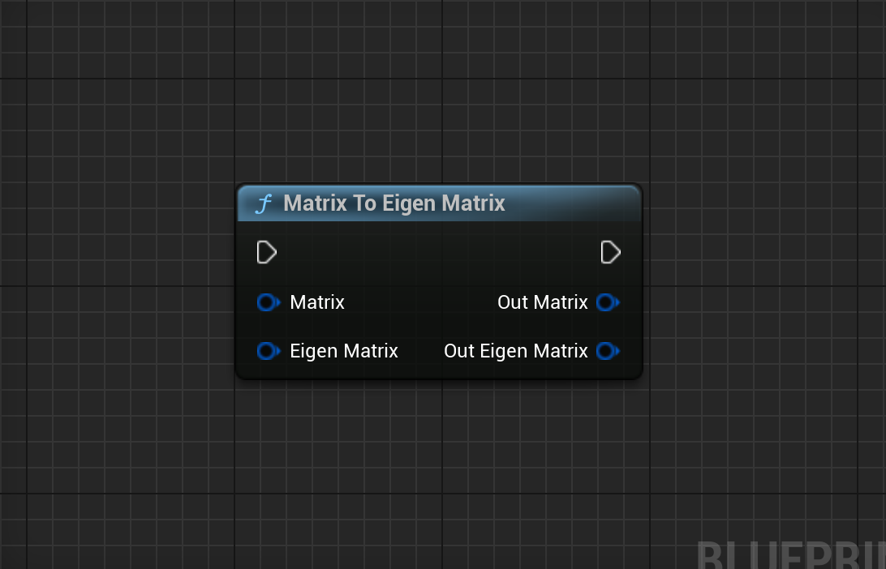

# EiV - Quick Linear Algebra and Matrix Access
## Unreal Engine Tools & Plugins - Engine Tools


## What is EiV?

EiV is a **C++ and Blueprint Library** for [Unreal Engine](https://www.unrealengine.com/) that is powered by the [Eigen](https://eigen.tuxfamily.org/index.php?title=Main_Page) library. Eigen is a **free**, third party **linear algebra library** for C++ that comes **built-in**🔧 to Unreal Engine. This plugin is meant to **save you the hassle** of trying to **include** Eigen in your own projects, to help the conversion between Unreal Engine and Eigen types be a bit smoother, and to provide an **easy interface**💻 to **Eigen functionality in [Blueprints](https://dev.epicgames.com/documentation/en-us/unreal-engine/blueprints-visual-scripting-in-unreal-engine)!** 

## Why EiV?

EiV is designed to be a *time-saver*⌚ when it comes to using linear algebra and Eigen in Unreal Engine. The include pattern it offers will *save you all of the issues* that come with including a third party library in Unreal Engine. EiV's macro-based include pattern makes sure that you *only need to include the main header* file to have access to *all of the code you need* in any C++ file. It also helps those that don't want to use C++ to still have linear algebra in blueprints! EiV also offers an *ever-growing*⬆️*suite of functions* for Blueprints to use linear algebra! If some part of the blueprint functionality looks incomplete, it will likely be added soon, since it takes a very long time to convert all of Eigen's functionality into Blueprints. You can go check out the EiV **public GitHub repo (you are already here)** to see what progress is being made, make suggestions, and maybe even get some updates before Fab!

## Features:
* **100+ Blueprint Functions** and counting - EiV has **growing blueprint support** for linear algebra - *something you won't find anywhere else!*
* **Dynamically-sized Real** and **Complex** valued matrices for blueprints!
* **250+ C++ typedefs** to make directly using Eigen types just a bit easier and to save you writing 'Eigen::' before everything
* **70+ C++ helper functions** to help with converting back and forth between Unreal Engine and Eigen types
* <ins>All code is public on GitHub</ins> - check out what is being updated and even suggest new functions to add!

## Support, Tutorials, and Documentation:

◿ For questions, feedback, and product support don't hesitate to contact us. You are also welcome to join our Discord community, [The Galaxy](https://discord.gg/usmH9mZGVe).
> The Galaxy is a community that is for interacting with us and others that use our products and support us. *You can join even if you haven't
purchased our products.* You can look at questions and written reviews from community members on a variety of topics relating to
what we do. We hope to see you there!

◿ A [setup tutorial](https://youtu.be/HEuoAquiClk) can be found on YouTube demonstrating how to get EiV working in an Unreal Engine project for Blueprints and C++

◿ Detailed documentation and the changelog is available below if you want to read more about EiV

## Documentation:

### Getting Started:

To begin using EiV, first either [download](https://www.fab.com/listings/3af63926-d16a-4a0f-8116-9979c0dfe9c0) the plugin from Fab or from the GitHub repository and [build](https://dev.epicgames.com/community/learning/tutorials/qz93/unreal-engine-building-plugins) it from source. EiV is engineered in Unreal Engine 5.1 to ensure it is compatible with versions 5.1 and above, however, Fab will only be guaranteed to have the latest three engine versions available. Once you have EiV in your engine's plugin directory *(Engine / Plugins / Marketplace /)*, open the project you want to use it in and enable the plugin. It should be under the programming category. You may need to restart Unreal Engine for changes to take effect. Then you should be good to go to start using Eigen through EiV in C++ and Blueprints. More specific instructions for each are in the below sections.

> [!NOTE]
> If you experience any errors on restarting or building just after EiV is activated (particularly relating to expecting to find a type declared in a module rules), See the [C++ section](#C++:) of the documentation for some tips on resolving that.

| Unreal Engine Version | EiV Compatible |
| --------------------- | -------------- |
| 4.27 and below        | ❌            |
| 5.0                   | ❌            |
| 5.1                   | ✅ Available on Fab |
| 5.2                   | ✅ Available on Fab |
| 5.3                   | ✅ Available on Fab |
| 5.4                   | ✅ Available on Fab |
| 5.5                   | ✅ Available on Fab |
| 5.6                   | ✅ Available on Fab |

| Platform | Officially Supported |
| -------- | --------- |
| Windows (32/64 bit) | ✅ Yes |
| Mac                 | ❌ No  |
| iOS                 | ❌ No  |
| Android             | ❌ No  |
| Linux               | ✅ Yes |

Any platform not supported currently can be supported with some changes in `EiVLibrary.h`. If you want to suggest changes that can be made to allow EiV to support these platforms feel free to do so!

### Blueprints:

Using EiV in Blueprints is quite simple. It is just implemented as a [Blueprint Function Library](https://dev.epicgames.com/documentation/en-us/unreal-engine/blueprint-function-libraries-in-unreal-engine) and should be accessible from the context menu by searching for 'EiV' (It will appear as 'Ei V' because of the way the engine parses text). 

> [!IMPORTANT]
> Not all EiV blueprint types do something as of now. We are working on adding and improving blueprint implementations over time, since Eigen is a large library to turn into blueprint functions.

Most EiV types are accessed via converter nodes. These nodes take what will be converted to the other type on one end and then swap that input type to the output. For example, the node below has a Matrix input and an Eigen Matrix input. Both of these inputs are reflected as outputs. When a normal matrix is input to this converter, the converter outputs the converted type from the Out Eigen Matrix pin. The pattern follows for an Eigen Matrix input - it is output from the Out Matrix pin. **Inputs do not directly carry through this node.** If a input pin is unconnected, that is no problem for EiV and it will just output the conversion of the empty type (often being 0 or some null matrix for blank inputs).



Once you have an Eigen/EiV type in your blueprint, you can use the EiV functions for those types. These functions are more or less a 1:1 mapping to the actual Eigen functions, so checking out the [Eigen documentation](https://eigen.tuxfamily.org/dox/) should help you understand how they work if you are unfamiliar.

### C++:

To use EiV in C++ is a bit more complicated than in Blueprints, but still far simpler than setting up Eigen yourself in C++. First, make sure you have an Unreal Engine project configured for C++. Then, go to whatever [module](https://dev.epicgames.com/documentation/en-us/unreal-engine/unreal-engine-modules) you plan on using EiV in. Open up the `build.cs` file for that module and add the string, `"EiV"`, to the public and/or private dependency module lists [as needed](https://dev.epicgames.com/documentation/en-us/unreal-engine/unreal-engine-modules#privateandpublicdependencies). EiV should be all linked up to your module and you should be good to start using EiV functionality in your modules files.

To include EiV in a `.h` or `.cpp` file, you need to follow a special pattern to make sure you access the Eigen modules you need and that their access doesn't spill over to other files where it may be unnecessary. An example of an EiV include is below.

```c
// ...

#define EIV_INCLUDE_DENSE_MATRIX_ARRAY
#define EIV_INCLUDE_GEOMETRY
#define EIV_UNDEFINE_INCLUDES

#include "../../Plugins/Marketplace/EiV_5_1/Source/EiV/Public/EiVLibrary.h"

// ...
```

What this include pattern does is it allows you to define macros that represent the Eigen headers you want to access through EiV. EiV takes those macros, includes the necessary files, and adds on its own extra utilities as needed for what was included. To break it down line by line, `#define EIV_INCLUDE_DENSE_MATRIX_ARRAY` defines a macro for retrieving all headers associated with arrays and dense matrices, `#define EIV_INCLUDE_GEOMETRY` includes the Eigen Geometry module header, and `#define EIV_UNDEFINE_INCLUDES` undefines any of these include macros within this file, effectively making them local when the `#include` [preprocessor](https://en.cppreference.com/w/cpp/preprocessor/include) pastes in the `EiVLibrary.h` file. The lengthy path for this file is to access it from the plugins folder of the engine. Note that the `EiV_5_1` may need to be changed to `EiV_<YOUR ENGINE VERSION>` based on what build of EiV you are using.

What the undefinition of these macros allows for is letting you access Eigen in another file within this module you are working in while not necessarily including anything you accessed in any other file, thus allowing for enhanced IWYU *(Include What You Use)* formatting and procedure. See more on Unreal Engine's take on IWYU [here](https://dev.epicgames.com/documentation/en-us/unreal-engine/include-what-you-use-iwyu-for-unreal-engine-programming).

Here is a list of EiV macros to declare before an include and what they do:

| EiV Macro Definition                        | Effect On Include                     |
| ------------------------------------------- | ------------------------------------- |
| `#define EIV_INCLUDE_CORE`                  | Includes the Eigen [Core](https://eigen.tuxfamily.org/dox/group__Core__Module.html) module        |
| `#define EIV_INCLUDE_JACOBI`                | Includes the Eigen [Jacobi](https://eigen.tuxfamily.org/dox/group__Jacobi__Module.html) module      |
| `#define EIV_INCLUDE_HOUSEHOLDER`           | Includes the Eigen [Householder](https://eigen.tuxfamily.org/dox/group__Householder__Module.html) module |
| `#define EIV_INCLUDE_DENSE_MATRIX_ARRAY`    | Includes the [Core](https://eigen.tuxfamily.org/dox/group__Core__Module.html), [Jacobi](https://eigen.tuxfamily.org/dox/group__Jacobi__Module.html), and [Householder](https://eigen.tuxfamily.org/dox/group__Householder__Module.html) modules      |
| `#define EIV_INCLUDE_CHOLESKY`              | Includes the Eigen [Cholesky](https://eigen.tuxfamily.org/dox/group__Cholesky__Module.html) module    |
| `#define EIV_INCLUDE_LU`                    | Includes the Eigen [LU](https://eigen.tuxfamily.org/dox/group__LU__Module.html) module          |
| `#define EIV_INCLUDE_QR`                    | Includes the Eigen [QR](https://eigen.tuxfamily.org/dox/group__QR__Module.html) module          |
| `#define EIV_INCLUDE_SVD`                   | Includes the Eigen [SVD](https://eigen.tuxfamily.org/dox/group__SVD__Module.html) module         |
| `#define EIV_INCLUDE_EIGENVALUES`           | Includes the Eigen [Eigenvalues](https://eigen.tuxfamily.org/dox/group__Eigenvalues__Module.html) module |
| `#define EIV_INCLUDE_DENSE_LINEAR_PROBLEMS` | Includes the [Cholesky](https://eigen.tuxfamily.org/dox/group__Cholesky__Module.html), [LU](https://eigen.tuxfamily.org/dox/group__LU__Module.html), [QR](https://eigen.tuxfamily.org/dox/group__QR__Module.html), [SVD](https://eigen.tuxfamily.org/dox/group__SVD__Module.html), and [Eigenvalues](https://eigen.tuxfamily.org/dox/group__Eigenvalues__Module.html) modules       |
| `#define EIV_INCLUDE_SPARSECORE`     | Includes the Eigen [Sparse Core](https://eigen.tuxfamily.org/dox/group__SparseCore__Module.html) module        |
| `#define EIV_INCLUDE_ORDERINGMETHODS`     | Includes the Eigen [Ordering Methods](https://eigen.tuxfamily.org/dox/group__OrderingMethods__Module.html) module |
| `#define EIV_INCLUDE_SPARSECHOLESKY`     | Includes the Eigen [Sparse Cholesky](https://eigen.tuxfamily.org/dox/group__SparseCholesky__Module.html) module |
| `#define EIV_INCLUDE_SPARSELU`     | Includes the Eigen [Sparse LU](https://eigen.tuxfamily.org/dox/group__SparseLU__Module.html) module |
| `#define EIV_INCLUDE_SPARSEQR`     | Includes the Eigen [Sparse QR](https://eigen.tuxfamily.org/dox/group__SparseQR__Module.html) module |
| `#define EIV_INCLUDE_ITERATIVELINEARSOLVERS`     | Includes the Eigen [Iterative Linear Solvers](https://eigen.tuxfamily.org/dox/group__IterativeLinearSolvers__Module.html) module |
| `#define EIV_INCLUDE_SPARSE_LINEAR_ALGEBRA`     | Includes the [Sparse Core](https://eigen.tuxfamily.org/dox/group__SparseCore__Module.html), [Sparse Cholesky](https://eigen.tuxfamily.org/dox/group__SparseCholesky__Module.html), [Sparse LU](https://eigen.tuxfamily.org/dox/group__SparseLU__Module.html), and [Sparse QR](https://eigen.tuxfamily.org/dox/group__SparseQR__Module.html) modules and the [Ordering Methods](https://eigen.tuxfamily.org/dox/group__OrderingMethods__Module.html) and [Iterative Linear Solvers](https://eigen.tuxfamily.org/dox/group__IterativeLinearSolvers__Module.html) modules |
| `#define EIV_INCLUDE_GEOMETRY`     | Includes the Eigen [Geometry](https://eigen.tuxfamily.org/dox/group__Geometry__Module.html) module |
| `#define EIV_NO_UTILITY`     | This macro removes any extra utility provided by EiV and only adds the Eigen modules |
| `#define EIV_UNDEFINE_INCLUDES`     | This macro undefines all of the above macros after EiV is included in the file |

Once EiV is all included, you can just start coding using the usual C++, Unreal Engine, and Eigen techniques. EiV also provides a helper struct, (`FEiVHelper`) to assist in conversions from Unreal Engine to Eigen types and provide a few other options for settings things up with Eigen. 

> [!WARNING]
> If you included EiV in your public and private module dependencies and your IDE still says it cannot include `EiVLibrary.h`, at least in [Visual Studio](https://visualstudio.microsoft.com/), there is a simple enough fix. Once you have built the project with EiV in your dependencies, go and regenerate the Visual Studio Project Files. Then, all you need to do is go to Project->Properties, and then in the new window, Config Properties->VC++ Directories, and finally put `$(LibraryPath)` in the Library Directories field. Refresh the VS project (in Visual Studio, <ins>not</ins> Unreal Engine) and [intellisense](https://learn.microsoft.com/en-us/visualstudio/ide/using-intellisense?view=vs-2022) should be able to acces the Eigen and EiV types now. Even if you cannot resolve this, the project will still work just fine, but you unfortunately won't have easy access to any form of intellisense for working with EiV and Eigen.

## Licensing Note:
Eigen is distributed under the [MPL2 License](https://www.mozilla.org/en-US/MPL/2.0/), so if you use Eigen functionality through EiV, you will need to make sure that you also take the appropriate actions that the MPL2 License requires for your software.

## Changelog:

### 6/18/25 - EiV 1.0.1 Release:
 - TL;DR the 'What's in my Matrix?' update
 - Unreal Engine 5.6 Support!🎉
 - Matrix All Finite Blueprint Function
 - Matrix Complete Orthogonal Decomposition Blueprint Function
 - Matrix Is Diagonal Blueprint Function
 - Matrix Is Identity Blueprint Function
 - Matrix Is Lower Triangular Blueprint Function
 - Matrix Is Upper Triangular Blueprint Function
 - Vector Is Orthogonal Blueprint Function
 - Matrix Is Unitary Blueprint Function
 - Matrix Is Ones Blueprint Function
 - Matrix Is Zero Blueprint Function
 - Matrix Diagonal Size Blueprint Function
 - Matrix Euler Angles Blueprint Function
 - Matrix Full Pivot LU Decomposition Blueprint Function
 - Matrix Has NaN Blueprint Function
 - Matrix Identity Blueprint Function
 - Matrix Norm Blueprint Function
 - Matrix Normalize Blueprint Function (for all matrices, not just vectors - normalizes according to the Frobenius norm of the matrix)
 - On any blueprint functions that create EiVDynamicVector structs, both an EiVDynamicVector and EiVDynamicMatrix output are provided

### 4/9/25 - EiV 1.0.0 Release:
 - Initial Release
 - Baseline features included
