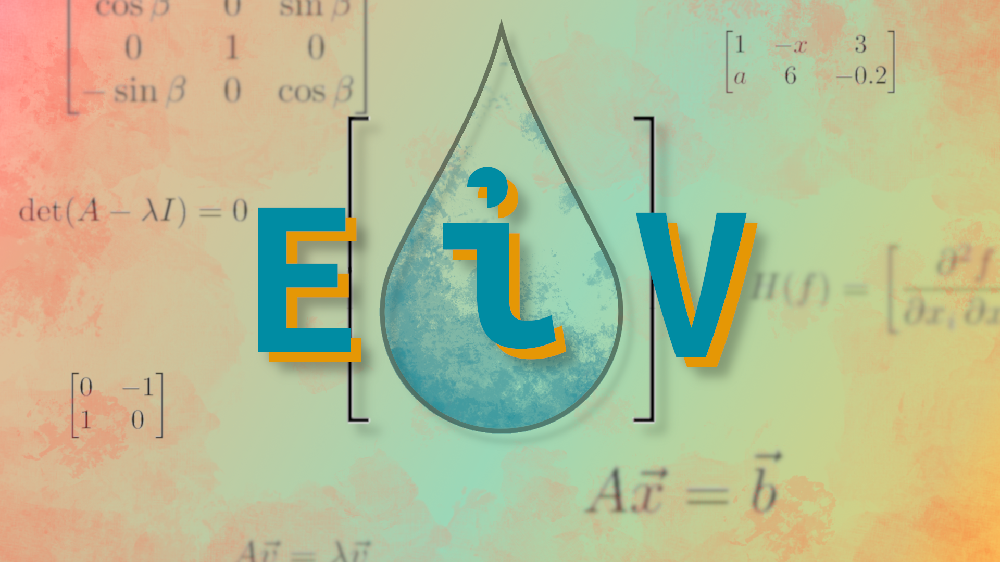

# EiV - Quick Linear Algebra and Matrix Access
## Unreal Engine Tools & Plugins - Engine Tools
Fab Listing: (url)

## What is EiV?

EiV is a **C++ and Blueprint Library** for Unreal Engine that is powered by the Eigen library. Eigen is a **free**, third party **linear algebra library** for C++ that comes **built-in**🔧 to Unreal Engine. This plugin is meant to **save you the hassle** of trying to **include** Eigen in your own projects, to help the conversion between Unreal Engine and Eigen types be a bit smoother, and to provide an **easy interface**💻 to **Eigen functionality in Blueprints!** 

## Why EiV?

EiV is designed to be a *time-saver*⌚ when it comes to using linear algebra and Eigen in Unreal Engine. The include pattern it offers will *save you all of the issues* that come with including a third party library in Unreal Engine. EiV's macro-based include pattern makes sure that you *only need to include the main header* file to have access to *all of the code you need* in any C++ file. It also helps those that don't want to use C++ to still have linear algebra in blueprints! EiV also offers an *ever-growing*⬆️*suite of functions* for Blueprints to use linear algebra! If some part of the blueprint functionality looks incomplete, it will likely be added soon, since it takes a very long time to convert all of Eigen's functionality into Blueprints. You can go check out the EiV **public GitHub repo (you are already here)** to see what progress is being made, make suggestions, and maybe even get some updates before Fab!

## Features:
* **80+ Blueprint Functions** and counting - EiV has **growing blueprint support** for linear algebra - *something you won't find anywhere else!*
* **Dynamically-sized Real** and **Complex** valued matrices for blueprints!
* **250+ C++ typedefs** to make directly using Eigen types just a bit easier and to save you writing 'Eigen::' before everything
* **70+ C++ helper functions** to help with converting back and forth between Unreal Engine and Eigen types
* <ins>All code is public on GitHub</ins> - check out what is being updated and even suggest new functions to add!

## Support, Tutorials, and Documentation:

◿ For questions, feedback, and product support don't hesitate to contact us. You are also welcome to join our Discord community, The Galaxy.
> The Galaxy is a community that is for interacting with us and others that use our products and support us. *You can join even if you haven't
purchased our products.* You can look at questions and written reviews from community members on a variety of topics relating to
what we do. We hope to see you there!

◿ TODO can be found on YouTube and cover everything from basic setup to making advanced systems with Streamline

◿ Detailed documentation is available here if you want to read more about Streamline

◿ Since this plugin is hosted on GitHub, go check out the EiV GitHub repo for any changes

<!-- MARKDOWN THEME -->
# $\textsf{\color{#f5750e}{f5750e}}$

## $\textsf{\color{#f48522}{f48522}}$

### $\textsf{\color{#326a95}{326a95}}$

#### $\textsf{\color{#18afd3}{18afd3}}$

##### $\textsf{\color{#5ec3d5}{5ec3d5}}$
